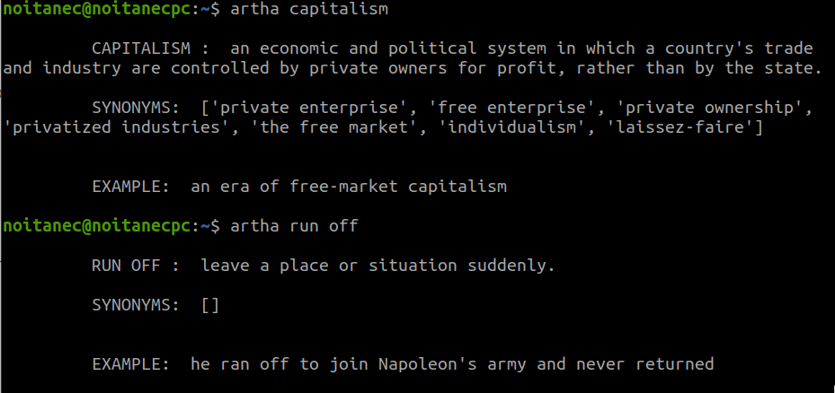

# dictionary
An online dictionary for terminal.

## Installation
1. Clone the repo.<br/>`git clone git@github.com:noitanec/dictionary.git`

2. Set path.<br>`export PATH=$PATH:<path_to_artha_file>`

## Run
```bash
artha <search_word>
```

## Results
<br>

